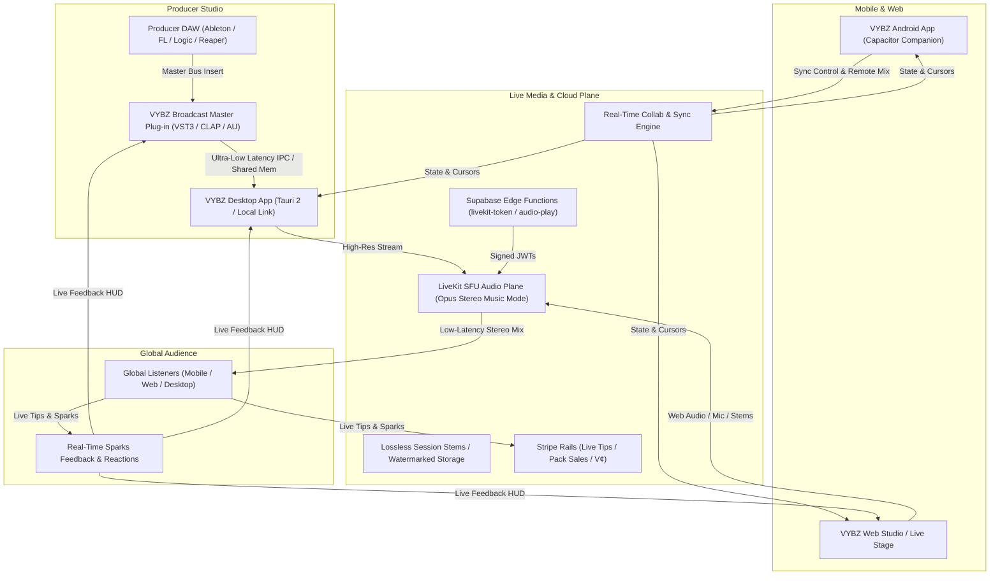

# Implementation Plan: Strategic Pivot to Live Mix Audio Streaming Platform

**Authoritative Product Direction:**  
> **"VYBZ is to become the ultimate live mix audio streaming platform, giving producers and artists a place to produce their music, sound and audio projects with listeners around the world in real time live."**

---

## User Review Required

> [!IMPORTANT]
> **Core Architectural Expansions:**
> 1. **Live-First Responsive Interface:** The old sample-pack stepper is removed as the default experience, replaced by an innovative, live-audio-friendly interface that auto-adapts across all screen sizes (mobile, tablet, desktop, ultra-wide) with live visualizers, broadcast meters, and stage controls.
> 2. **Android Multi-Device Synchronization:** First-class Android release enabling producers and listeners to synchronize mobile devices with live sessions (companion control mode, remote live mixing, lockstep playback).
> 3. **VYBZ Broadcast DAW Master Channel Plug-in (VST3 / CLAP / AU):** A dedicated master channel plug-in for all major DAWs (Ableton, FL Studio, Logic, Reaper, Pro Tools, Bitwig) to capture pristine master-bus audio directly from the DAW buffer and stream it in real time to the live mix room.
> 4. **Preservation Invariant:** All existing sample pack and DSP tools remain intact and callable as in-session plugins and post-stream export tools.

---

## 1. Architectural Architecture & Restructuring Map

### 1.1 The VYBZ Live Ecosystem Architecture

---

### 1.2 Core Experience Pillars & Upgrades

#### A. Innovative Live Audio-Friendly Interface
- **Auto-Responsive Matrix:** Fluid layout engine adapting from single-hand mobile (portrait live view) up to multi-monitor studio setups (docked meters, visualizer stage, chat stream, stem mixer).
- **Stage & Deck Ergonomics:** Replaces the linear pack pipeline with a dynamic live deck featuring live waveform HUD, BS.1770 LUFS metering, participant presence, and active audience reaction bursts.
- **Audio-Reactive Visualizer:** Seamless WebGL shader integration syncing visuals directly to stream transients.

#### B. Android Multi-Device Synchronization
- **Companion Mode:** Producers can use their Android phone/tablet as a hardware-like remote control for their live session (fader control, mute, spark trigger, chat monitor) while producing on desktop.
- **Mobile Live Ingest:** Artists can stream live sets on the go directly from mobile audio interfaces with background audio persistence via Capacitor Platform Bridge.
- **Lockstep Listener Sync:** Global listeners enjoy synchronized, low-latency audio playback across devices.

#### C. VYBZ Broadcast DAW Plug-in (VST3 / CLAP / AU)
- **Direct Master Bus Capture:** Plugs into the Master Channel of any major DAW. Captures 32-bit float audio buffer directly before OS sound driver degradation.
- **Zero-Friction Link:** Uses local IPC / WebSocket to hand off high-fidelity stereo audio to the VYBZ LiveKit SFU at up to 510 kbps Opus Music Mode.
- **In-DAW Live HUD:** Shows active listener count, live chat alerts, Sparks sentiment, and stream health directly inside the DAW window.

#### D. Subordinated Production Tooling & Post-Stream Monetization
- **In-Session Tool Drawer:** Instant access to 9 DSP correction desks, Stem splitter, MIDI extractor, and Translation simulation (car/club monitors) without leaving the live session.
- **One-Click Post-Live Pack Export:** When a live session concludes, the recorded audio/stems can be packaged into a measured sample pack with SHA manifest and listed on the Marketplace with a single click.

---

## 2. Proposed Changes & Document Rewrites

### Authority & Direction
#### [MODIFY] [PRODUCT.md](file:///c:/Users/Godmode/Documents/VYBZ/PRODUCT.md)
Full rewrite establishing VYBZ as the ultimate live mix audio streaming platform. Specifies:
- Live mix streaming core pillars (DAW plugin, LiveKit audio plane, live production rooms).
- Responsive, live-audio-friendly interface across mobile, tablet, and desktop.
- Android multi-device sync and companion mode.
- VST3/CLAP master bus broadcast bridge.
- Subordinated pack creation, marketplace, and DSP tooling.
- Delivery vocabulary, honesty rules, and PRESERVATION.

#### [MODIFY] [README.md](file:///c:/Users/Godmode/Documents/VYBZ/README.md)
Update module table, system overview, and client descriptions (Web, Android, Desktop, DAW Plugin).

#### [MODIFY] [src/product/invariants.ts](file:///c:/Users/Godmode/Documents/VYBZ/src/product/invariants.ts)
Update invariants to enshrine live-mix streaming principles while preserving all test gates and delivery states.

#### [MODIFY] [STATE.md](file:///c:/Users/Godmode/Documents/VYBZ/STATE.md)
Add 2026-08-17 pivot checkpoint, documenting current verified test status (158 files / 808 tests) and live media plane readiness.

#### [MODIFY] [docs/products/LIVE.md](file:///c:/Users/Godmode/Documents/VYBZ/docs/products/LIVE.md)
Update Live product brief with DAW plugin integration, high-fidelity music mode, and multi-device sync.

#### [NEW] [docs/decisions/0004-live-mix-streaming-platform.md](file:///c:/Users/Godmode/Documents/VYBZ/docs/decisions/0004-live-mix-streaming-platform.md)
Formal decision record superseding 0003 for primary focus while preserving sample pack infrastructure.

---

## 3. Phased Execution Roadmap

1. **Phase A: Direction Rewrite & Authority Alignment** — landed on `continue-next` (`f9d27c24`).
2. **Phase B: Live-First Responsive Shell & Room UI** — landed on `continue-next` (`d9b0b47e`).
3. **Phase C: DAW Broadcast Plug-in (VST3 / CLAP / Remote Link)** — client protocol + Go Live ingest **PARTIALLY IMPLEMENTED**. Native VST3/CLAP/AU remains **NATIVE-PLATFORM ONLY** (not in this repo). Production `live_sessions.source` CHECK still rejects `daw`; ingest is persisted as `display` + `monetization.ingest`.
4. **Phase D: Android Multi-Device Sync & Companion Control** — companion protocol + `/live/:id/companion` over Supabase realtime **PARTIALLY IMPLEMENTED**. Faders do not yet change the published mix. Domain stays on the Platform Bridge / web APIs — no Capacitor imports.
5. **Phase E: In-Session Desks & Post-Live Pack Export** — session drawer links existing desks. Pack Maker is opened from a live session; stems are **not** auto-assembled.

---

## 4. Verification Plan

- `npm run lint` (`tsc --noEmit`)
- `npm run test` (All 158 test files / 808 tests must pass)
- `npm run build` (Vite production build must succeed)
- `npm run check:no-fixtures` (Fixture guard validation)
